# Long Range Constraints for Neural Texture Synthesis Using Sliced Wasserstein Loss
This is the project page for "Long Range Constraints for Neural Texture Synthesis Using Sliced Wasserstein Loss." We propose an improvement of "A Sliced Wasserstein Loss for Neural Texture Synthesis" by Heitz et al. by adding an additional loss term to capture nonstationary statistics in textures. Here are some examples of our synthesis with comparisions other algorithms. **Left:** Reference, **Second Column:** Original SW Synthesis, **Third Column:** Spectrum Constraint, **Right:** Our Algorithm (K=0).

 
  

  
   
    
   
     

  
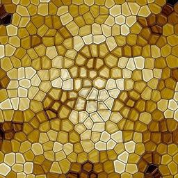
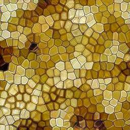
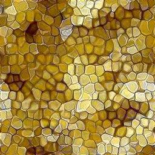
 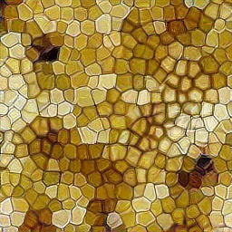

The texures above were mostly periodic or pseudoperiodic, so let's test our algorithm on some textures that have less stationary components. For our comparison, we compare our alogorithm with K = 1 against Heitz et. al. and with Gonthier et. al. **Left:** Reference, **Second Column:** Original SW Synthesis, **Third Column:** Gonthier, **Right:** Our Algorithm (K=1).

 

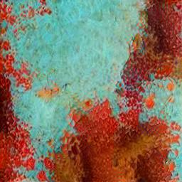
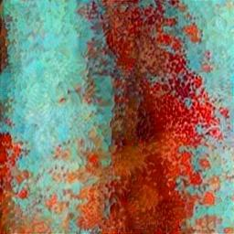
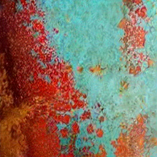
    
   
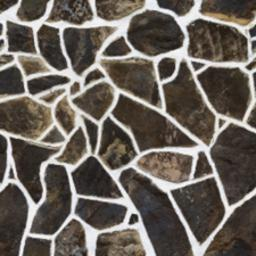
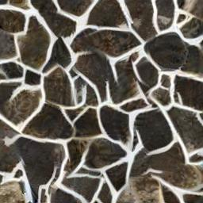
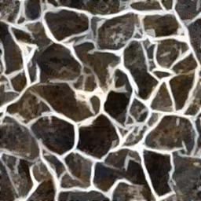
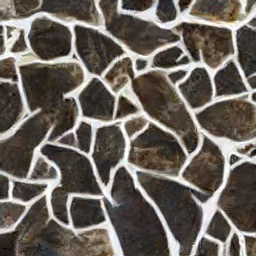
    
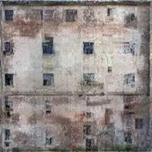
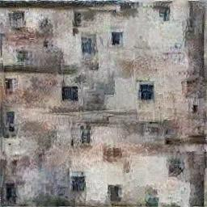
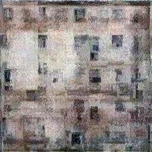
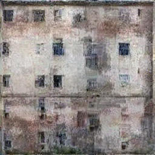
    

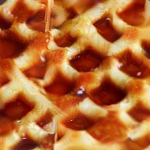
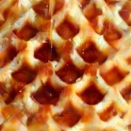
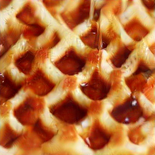
    

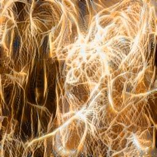

    
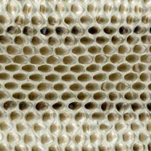
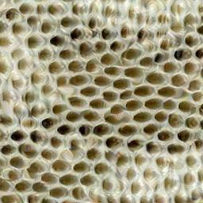
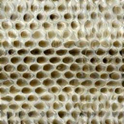
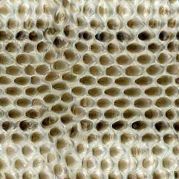

